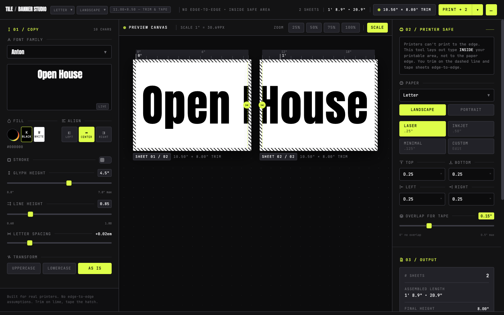

# Tile Banner Studio



Dark pro banner lab for a trim-with-scissors, tape-overlap or tape-edge-to-edge workflow — no type lost to the printer.

Choose paper (Letter, Legal, A4) and orientation. Type is laid out only inside the printable area, then sliced across sheets with `translateX` so letters line up after you trim on the scissor guide and tape the overlap.

**Tape overlap is on by default.** In the code this is asymmetric trim (`ASSEMBLY_ASYMMETRIC_TRIM` in `src/lib/layout.js`): the same join PDF Press and Acrobat-style tiling describe. The Print menu’s first item, **Tape overlap**, is checked, and **Overlap for Tape** is a four-step control: **0.15"**, **0.25"**, **0.35"**, and **0.50"**. New banners start at **0.50"**. Each sheet prints that extra strip of the next slice, so the same distance of type appears on the right of one page and the left of the next. Cut only the following sheet, on the scissor line 0.05" inside that strip, and lay it over the earlier sheet’s uncut flap. **How to assemble** in the header explains this. Uncheck Tape overlap to switch to an edge-to-edge butt joint (`ASSEMBLY_EDGE_TO_EDGE`): both sides of the seam are cut, the tape strip is blank, and the header explanation changes to match.

The original single-file artifact is preserved at `reference/Tile-Banner-Studio-Dark.orig.html`.

## Run locally

```bash
npm install
npm run dev
```

Open the URL Vite prints (usually `http://localhost:5173`).

## Production build

```bash
npm run build
npm run preview
```

`npm run build` writes a static site to `dist/`. Serve that folder from any static host:

```bash
python3 -m http.server -d dist 8080
```

## Deploy

Upload the contents of `dist/` to any static host (Vercel, Netlify, GitHub Pages, S3, nginx). There is no backend. Example with the Vercel CLI after `npm run build`:

```bash
npx vercel --prod dist
```

## How the layout works

- Printable area (trim) = sheet width − left − right by sheet height − top − bottom
- Advance per sheet (`contentWidth`) = trim width − tape overlap (default 0.50")
- With Tape overlap on, each sheet clips `trimWidth` of type and advances by `contentWidth`, so the overlap strip is duplicated; with it off, the window is `contentWidth` and the tape strip is blank
- Canvas `measureText` of the banner strip → sheet count (`ceil((textWidth − overlap) / contentWidth)` when overlap copy is on)
- Assembled length = `sheets × trimWidth − (sheets − 1) × overlap`
- Glyph height runs from 0.8" up to the current sheet’s printable height (page size and orientation, minus the top and bottom margins)

## GUI

**Left — 01 / Copy:** banner text, font (Anton, Bebas Neue, Oswald 700, Impact, Archivo Black, Black Ops One, Monoton, Space Grotesk Bold), glyph height, letter-spacing, transform, fill + stroke.

**Center — Preview:** inch/foot ruler, sheet cards at 90px per inch with zoom 25/50/75/100%, dotted safe area, lime trim, yellow tape zone, sheet numbers.

**Right — 02 / Printer Safe & 03 / Output:** paper and orientation, margin presets, overlap 0.15 / 0.25 / 0.35 / 0.50" (default 0.50"), stats, display toggles, assembly diagram, **Print** (Tape overlap and Scissor edge guide on by default).

Settings (copy, type, margins, overlap, toggles) persist in `localStorage` and restore on reload.

Print uses `@page { size: <sheet>; margin: 0 }` from the current paper and orientation. The print subtree (`#print-area`) is a sibling of the app chrome so it is not hidden by screen-only CSS.
